# React Paradigm & Setup: The Foundation of Modern Web Development

## 🚀 Introduction: What is React and Why Does It Matter?

React is a **declarative, component-based JavaScript library** for building user interfaces, created by Facebook (now Meta) in 2013. It has revolutionized how we build web applications by introducing a completely different way of thinking about UI development.

### 🎯 The Paradigm Shift: From Imperative to Declarative

#### Traditional Imperative Approach (The Old Way)
```javascript
// Manually manipulating the DOM - Imperative
const button = document.getElementById('like-button');
const counter = document.getElementById('like-counter');
let likes = 0;

button.addEventListener('click', () => {
  likes++;
  counter.textContent = likes;
  button.textContent = likes === 1 ? 'Unlike' : 'Like';
  button.className = likes > 0 ? 'liked' : '';
  
  // What happens when you have 50+ elements to update?
  // What if you forget to update one element?
  // How do you handle complex state dependencies?
});
```

#### React Declarative Approach (The New Way)
```jsx
// Describing what the UI should look like - Declarative
function LikeButton() {
  const [likes, setLikes] = useState(0);
  const isLiked = likes > 0;
  
  return (
    <div>
      <span>{likes} likes</span>
      <button 
        className={isLiked ? 'liked' : ''} 
        onClick={() => setLikes(likes + 1)}
      >
        {isLiked ? 'Unlike' : 'Like'}
      </button>
    </div>
  );
}
// React automatically handles all DOM updates!
```

### 🏗️ React's Core Architecture: The Virtual DOM System

React's revolutionary approach centers around the **Virtual DOM** - a game-changing concept that makes web applications incredibly efficient.

#### How Virtual DOM Works

```
1. STATE CHANGE
   ↓
2. NEW VIRTUAL DOM TREE CREATED
   ↓
3. DIFFING ALGORITHM
   (Compare old vs new Virtual DOM)
   ↓
4. RECONCILIATION
   (Calculate minimal changes needed)
   ↓
5. DOM UPDATES
   (Only changed elements are updated)
```

#### Real-World Performance Example
```jsx
// Without React - Inefficient
function updateUserList(users) {
  const container = document.getElementById('user-list');
  container.innerHTML = ''; // Destroys everything!
  
  users.forEach(user => {
    const div = document.createElement('div');
    div.innerHTML = `<h3>${user.name}</h3><p>${user.email}</p>`;
    container.appendChild(div); // Recreates everything!
  });
}

// With React - Efficient
function UserList({ users }) {
  return (
    <div id="user-list">
      {users.map(user => (
        <div key={user.id}>
          <h3>{user.name}</h3>
          <p>{user.email}</p>
        </div>
      ))}
    </div>
  );
}
// React only updates changed users, not the entire list!
```

## 🧩 The Component Model: Building UIs Like LEGO Blocks

### 🎨 What Makes Components Revolutionary?

Components transform complex UIs into manageable, reusable pieces. Think of building a house:
- **Traditional Approach**: Build everything as one massive, monolithic structure
- **Component Approach**: Build with standardized, reusable blocks that fit together perfectly

### 📱 Real-World Component Hierarchy

Imagine building Instagram:

```
📱 InstagramApp (Root Component)
├── 🏠 Header
│   ├── 📷 Logo
│   ├── 🔍 SearchBar
│   ├── ➕ NewPostButton
│   └── 👤 UserMenu
│       ├── 👤 ProfileLink
│       ├── ⚙️ SettingsLink
│       └── 🚪 LogoutButton
├── 📱 MainContent
│   ├── 📝 Stories
│   │   ├── 📖 Story (reused for each story)
│   │   ├── 📖 Story
│   │   └── ➕ AddStoryButton
│   ├── 📄 Feed
│   │   ├── 📋 Post (reused for each post)
│   │   │   ├── 👤 PostHeader
│   │   │   │   ├── 🖼️ Avatar
│   │   │   │   ├── 📝 Username
│   │   │   │   └── ⋯ OptionsMenu
│   │   │   ├── 🖼️ PostImage
│   │   │   ├── 🎬 PostActions
│   │   │   │   ├── ❤️ LikeButton
│   │   │   │   ├── 💬 CommentButton
│   │   │   │   ├── 📤 ShareButton
│   │   │   │   └── 🔖 SaveButton
│   │   │   ├── 📊 PostStats
│   │   │   └── 💬 CommentSection
│   │   │       ├── 💬 Comment (reused)
│   │   │       ├── 💬 Comment
│   │   │       └── ➕ AddCommentInput
│   │   └── ♾️ LoadMoreButton
│   └── 📧 Suggestions
│       ├── 👥 SuggestedUsers
│       │   ├── 👤 UserSuggestion (reused)
│       │   └── 👤 UserSuggestion
│       └── 📢 Advertisements
└── 🦶 Footer
    ├── 🔗 FooterLinks
    └── ©️ Copyright
```

### 🔧 Component Types and When to Use Them

#### 1. **Functional Components** (Modern Standard)
```jsx
// ✅ Simple, Clean, Modern
function WelcomeCard({ userName, joinDate, avatar }) {
  return (
    <div className="welcome-card">
      
      <h2>Welcome back, {userName}!</h2>
      <p>Member since {new Date(joinDate).getFullYear()}</p>
    </div>
  );
}

// ✅ Arrow Function Version (Popular Style)
const WelcomeCard = ({ userName, joinDate, avatar }) => {
  return (
    <div className="welcome-card">
      
      <h2>Welcome back, {userName}!</h2>
      <p>Member since {new Date(joinDate).getFullYear()}</p>
    </div>
  );
};
```

#### 2. **Stateful Components** (With Hooks)
```jsx
import { useState, useEffect } from 'react';

const LiveNotificationBell = ({ userId }) => {
  const [notifications, setNotifications] = useState([]);
  const [unreadCount, setUnreadCount] = useState(0);
  const [isOpen, setIsOpen] = useState(false);

  useEffect(() => {
    // Set up real-time notification listener
    const unsubscribe = subscribeToNotifications(userId, (newNotifications) => {
      setNotifications(newNotifications);
      setUnreadCount(newNotifications.filter(n => !n.read).length);
    });

    return () => unsubscribe(); // Cleanup
  }, [userId]);

  return (
    <div className="notification-bell">
      <button 
        onClick={() => setIsOpen(!isOpen)}
        className="bell-button"
      >
        🔔
        {unreadCount > 0 && (
          <span className="badge">{unreadCount}</span>
        )}
      </button>
      
      {isOpen && (
        <NotificationDropdown 
          notifications={notifications}
          onMarkAsRead={(id) => markNotificationAsRead(id)}
        />
      )}
    </div>
  );
};
```

### 🎯 Component Design Principles

#### 1. **Single Responsibility Principle**
```jsx
// ❌ BAD: Component doing too many things
function UserDashboard({ user }) {
  const [posts, setPosts] = useState([]);
  const [friends, setFriends] = useState([]);
  const [notifications, setNotifications] = useState([]);
  const [weather, setWeather] = useState(null);
  
  // Fetching user posts
  useEffect(() => { /* fetch posts */ }, []);
  // Fetching friends
  useEffect(() => { /* fetch friends */ }, []);
  // Fetching notifications
  useEffect(() => { /* fetch notifications */ }, []);
  // Fetching weather
  useEffect(() => { /* fetch weather */ }, []);
  
  return (
    <div>
      {/* Rendering everything in one component */}
      <UserProfile user={user} />
      <PostsList posts={posts} />
      <FriendsList friends={friends} />
      <NotificationsList notifications={notifications} />
      <WeatherWidget weather={weather} />
    </div>
  );
}

// ✅ GOOD: Each component has one responsibility
const UserDashboard = ({ user }) => {
  return (
    <div className="dashboard">
      <UserProfileSection user={user} />
      <PostsSection userId={user.id} />
      <FriendsSection userId={user.id} />
      <NotificationsSection userId={user.id} />
      <WeatherSection location={user.location} />
    </div>
  );
};

const PostsSection = ({ userId }) => {
  const [posts, setPosts] = useState([]);
  
  useEffect(() => {
    fetchUserPosts(userId).then(setPosts);
  }, [userId]);
  
  return (
    <section className="posts-section">
      <h2>Your Posts</h2>
      <PostsList posts={posts} />
    </section>
  );
};
```

#### 2. **Composition Over Inheritance**
```jsx
// ✅ Flexible Modal Component
const Modal = ({ isOpen, onClose, children, title }) => {
  if (!isOpen) return null;
  
  return (
    <div className="modal-overlay" onClick={onClose}>
      <div className="modal-content" onClick={e => e.stopPropagation()}>
        <div className="modal-header">
          <h2>{title}</h2>
          <button onClick={onClose}>✕</button>
        </div>
        <div className="modal-body">
          {children}
        </div>
      </div>
    </div>
  );
};

// Usage: Compose different modals
const App = () => {
  const [showLogin, setShowLogin] = useState(false);
  const [showSettings, setShowSettings] = useState(false);
  
  return (
    <div>
      <button onClick={() => setShowLogin(true)}>Login</button>
      <button onClick={() => setShowSettings(true)}>Settings</button>
      
      <Modal 
        isOpen={showLogin} 
        onClose={() => setShowLogin(false)}
        title="Sign In"
      >
        <LoginForm />
      </Modal>
      
      <Modal 
        isOpen={showSettings} 
        onClose={() => setShowSettings(false)}
        title="Settings"
      >
        <SettingsPanel />
      </Modal>
    </div>
  );
};
```

### 🎪 Advanced Component Patterns

#### 1. **Compound Components Pattern**
```jsx
// Build components that work together like HTML elements
const Tabs = ({ children, activeTab, onTabChange }) => {
  return (
    <div className="tabs">
      {React.Children.map(children, (child, index) => 
        React.cloneElement(child, { 
          isActive: index === activeTab,
          onClick: () => onTabChange(index)
        })
      )}
    </div>
  );
};

const Tab = ({ children, isActive, onClick }) => (
  <button 
    className={`tab ${isActive ? 'active' : ''}`}
    onClick={onClick}
  >
    {children}
  </button>
);

const TabPanel = ({ children, isActive }) => (
  isActive ? <div className="tab-panel">{children}</div> : null
);

// Usage
<Tabs activeTab={activeTab} onTabChange={setActiveTab}>
  <Tab>Profile</Tab>
  <Tab>Settings</Tab>
  <Tab>Notifications</Tab>
</Tabs>
<TabPanel isActive={activeTab === 0}>
  <UserProfile />
</TabPanel>
<TabPanel isActive={activeTab === 1}>
  <Settings />
</TabPanel>
```

#### 2. **Render Props Pattern**
```jsx
const DataFetcher = ({ url, children }) => {
  const [data, setData] = useState(null);
  const [loading, setLoading] = useState(true);
  const [error, setError] = useState(null);
  
  useEffect(() => {
    fetch(url)
      .then(response => response.json())
      .then(data => {
        setData(data);
        setLoading(false);
      })
      .catch(error => {
        setError(error);
        setLoading(false);
      });
  }, [url]);
  
  return children({ data, loading, error });
};

// Usage - Same component, different UIs
<DataFetcher url="/api/users">
  {({ data, loading, error }) => {
    if (loading) return <Skeleton />;
    if (error) return <ErrorMessage error={error} />;
    return <UserList users={data} />;
  }}
</DataFetcher>

<DataFetcher url="/api/posts">
  {({ data, loading, error }) => {
    if (loading) return <div>Loading posts...</div>;
    if (error) return <div>Failed to load posts</div>;
    return <PostGrid posts={data} />;
  }}
</DataFetcher>
```

## ⚡ Setting Up Your Development Environment with Vite

### 🚀 Why Vite is the Future of React Development

Vite (pronounced "veet", French for "fast") represents the next generation of build tools. Here's why it's become the industry standard:

#### 📊 Vite vs Create-React-App Performance Comparison

| Feature | Vite | Create-React-App | Winner |
|---------|------|------------------|--------|
| **Cold Start** | ~200ms | 15-30s | 🏆 Vite |
| **Hot Reload** | Instant | 1-5s | 🏆 Vite |
| **Build Speed** | 2x faster | Baseline | 🏆 Vite |
| **Bundle Size** | Smaller | Larger | 🏆 Vite |
| **TypeScript** | Built-in | Requires config | 🏆 Vite |
| **Modern JS** | ES modules | Webpack | 🏆 Vite |
| **Developer Experience** | Excellent | Good | 🏆 Vite |

#### 🔧 What Makes Vite Revolutionary?

```
Traditional Bundler (Webpack):
Source Files → Bundle Everything → Serve Bundle → Browser
     ↓              ↓              ↓         ↓
   Slow            Slow           Slow    Page Load

Vite's Approach:
Source Files → Serve Individual ES Modules → Browser
     ↓                     ↓                    ↓
   Fast                  Fast               Page Load
```

### 🏗️ Project Setup: Step-by-Step Guide

#### 1. **Create Your React Project**

```bash
# 🚀 Create a new React + TypeScript project
npm create vite@latest my-awesome-app -- --template react-ts

# 📁 Navigate to your project
cd my-awesome-app

# 📦 Install dependencies
npm install

# 🎯 Start development server
npm run dev
```

#### 2. **Available Templates and When to Use Them**

```bash
# 📝 JavaScript only (simpler, but less type safety)
npm create vite@latest my-app -- --template react

# ⚡ TypeScript (recommended for larger projects)
npm create vite@latest my-app -- --template react-ts

# 🔥 SWC for ultra-fast compilation (experimental)
npm create vite@latest my-app -- --template react-swc-ts

# 📱 PWA (Progressive Web App) template
npm create vite@latest my-app -- --template react-ts-pwa
```

#### 3. **Understanding What Happens Behind the Scenes**

```mermaid
graph TD
    A[npm create vite] --> B[Download Template]
    B --> C[Setup Project Structure]
    C --> D[Install Dependencies]
    D --> E[Configure Build Tools]
    E --> F[Ready to Code! 🎉]
```



### 📁 Project Structure Deep Dive

#### 🏗️ Complete File Architecture

```
my-awesome-app/
├── 📄 index.html              # HTML entry point (Vite serves this)
├── 📦 package.json            # Dependencies & scripts
├── ⚡ vite.config.ts          # Vite configuration
├── 🔧 tsconfig.json           # TypeScript configuration
├── 🌐 tsconfig.node.json      # TypeScript for Node.js tools
├── 🎨 tailwind.config.js      # Tailwind CSS config (if added)
├── 📋 .eslintrc.cjs           # ESLint rules
├── 🚫 .gitignore              # Git ignore rules
├── 📖 README.md               # Project documentation
├── 📁 public/                 # Static assets (served directly)
│   ├── 🖼️ favicon.ico         # Browser tab icon
│   ├── 🎯 vite.svg            # Vite logo
│   └── 🤖 robots.txt          # Search engine instructions
├── 📁 src/                    # Source code (your main workspace)
│   ├── 🎯 main.tsx            # Entry point - mounts React app
│   ├── ⚛️ App.tsx             # Root React component
│   ├── 🎨 App.css             # App-specific styles
│   ├── 🌍 index.css           # Global styles
│   ├── 🏷️ vite-env.d.ts       # Vite TypeScript declarations
│   ├── 📁 components/         # Reusable UI components
│   │   ├── 🎛️ ui/             # Base UI components
│   │   ├── 📄 layout/         # Layout components
│   │   └── 🔧 features/       # Feature-specific components
│   ├── 📁 hooks/              # Custom React hooks
│   ├── 📁 utils/              # Utility functions
│   ├── 📁 types/              # TypeScript type definitions
│   ├── 📁 assets/             # Images, fonts, etc.
│   │   ├── 🖼️ images/
│   │   ├── 🔤 fonts/
│   │   └── 🎬 videos/
│   └── 📁 styles/             # Organized CSS files
│       ├── 🌍 globals.css
│       ├── 🎨 components.css
│       └── 📱 responsive.css
└── 📁 dist/                   # Built files (created by npm run build)
    ├── 📄 index.html
    ├── 📁 assets/
    └── 🎯 Other optimized files
```

### 🔍 Key Files Explained in Detail

#### 1. **`index.html` - The Gateway**
```html
<!doctype html>
<html lang="en">
  <head>
    <meta charset="UTF-8" />
    <!-- 🎯 Browser tab icon -->
    <link rel="icon" type="image/svg+xml" href="/vite.svg" />
    <!-- 📱 Mobile responsiveness -->
    <meta name="viewport" content="width=device-width, initial-scale=1.0" />
    <!-- 🏷️ Page title (can be changed dynamically) -->
    <title>My Awesome React App</title>
    <!-- 🎨 You can add global styles, fonts, analytics here -->
    <link rel="preconnect" href="https://fonts.googleapis.com">
  </head>
  <body>
    <!-- 🎯 React app will be mounted to this div -->
    <div id="root"></div>
    <!-- ⚡ Vite automatically transforms this import -->
    <script type="module" src="/src/main.tsx"></script>
  </body>
</html>
```

#### 2. **`src/main.tsx` - The React Bootstrap**
```tsx
import React from 'react'
import ReactDOM from 'react-dom/client'
import App from './App.tsx'
import './index.css'

// 🎯 Get the root element from HTML
const rootElement = document.getElementById('root')!

// 🚀 Create React root and mount app
ReactDOM.createRoot(rootElement).render(
  <React.StrictMode>
    {/* 🧪 StrictMode helps catch bugs during development */}
    <App />
  </React.StrictMode>,
)

// 🔥 What React.StrictMode does:
// - Identifies components with unsafe lifecycles
// - Warns about legacy string ref API usage
// - Warns about deprecated findDOMNode usage
// - Detects unexpected side effects
// - Helps prepare your app for concurrent features
```

#### 3. **`src/App.tsx` - Your Canvas**
```tsx
import { useState } from 'react'
import reactLogo from './assets/react.svg'
import viteLogo from '/vite.svg'
import './App.css'

function App() {
  // 🎛️ State management with hooks
  const [count, setCount] = useState(0)
  
  // 🎨 Event handlers
  const handleIncrement = () => {
    setCount(prevCount => prevCount + 1)
  }
  
  const handleReset = () => {
    setCount(0)
  }

  return (
    <div className="App">
      {/* 🖼️ Logo section */}
      <div className="logo-section">
        <a href="https://vitejs.dev" target="_blank" rel="noopener noreferrer">
          
        </a>
        <a href="https://react.dev" target="_blank" rel="noopener noreferrer">
          
        </a>
      </div>
      
      {/* 📄 Main content */}
      <h1>Vite + React</h1>
      
      {/* 🎛️ Interactive counter */}
      <div className="card">
        <button onClick={handleIncrement}>
          count is {count}
        </button>
        <button onClick={handleReset}>
          Reset
        </button>
        <p>
          Edit <code>src/App.tsx</code> and save to test HMR
        </p>
      </div>
      
      {/* 📚 Learning resources */}
      <p className="read-the-docs">
        Click on the Vite and React logos to learn more
      </p>
    </div>
  )
}

export default App
```

#### 4. **`vite.config.ts` - Build Configuration**
```typescript
import { defineConfig } from 'vite'
import react from '@vitejs/plugin-react'
import path from 'path'

// 🔧 Vite configuration
export default defineConfig({
  plugins: [react()],
  
  // 🎯 Path resolution
  resolve: {
    alias: {
      '@': path.resolve(__dirname, './src'),
      '@components': path.resolve(__dirname, './src/components'),
      '@hooks': path.resolve(__dirname, './src/hooks'),
      '@utils': path.resolve(__dirname, './src/utils'),
      '@types': path.resolve(__dirname, './src/types'),
    },
  },
  
  // 🌐 Development server configuration
  server: {
    port: 3000,
    open: true, // Automatically open browser
    host: true, // Listen on all addresses
  },
  
  // 🏗️ Build configuration
  build: {
    outDir: 'dist',
    sourcemap: true,
    rollupOptions: {
      output: {
        manualChunks: {
          vendor: ['react', 'react-dom'],
          utils: ['lodash', 'date-fns'],
        },
      },
    },
  },
  
  // 🧪 Testing configuration
  test: {
    globals: true,
    environment: 'jsdom',
    setupFiles: ['./src/test/setup.ts'],
  },
})
```

### 🚀 Essential Development Commands

```bash
# 🏁 Start development server (with hot reload)
npm run dev

# 🏗️ Build for production
npm run build

# 🔍 Preview production build locally
npm run preview

# 🧹 Lint your code
npm run lint

# 🧪 Run tests (if configured)
npm run test

# 📦 Analyze bundle size
npm run build -- --analyze

# 🧽 Clean build artifacts
rm -rf dist node_modules && npm install
```

### 🎯 Development Workflow Best Practices

#### 1. **Hot Module Replacement (HMR) Magic**
```jsx
// ✨ With Vite, any change to this component updates instantly
const CounterButton = () => {
  const [count, setCount] = useState(0)
  
  return (
    <button 
      onClick={() => setCount(c => c + 1)}
      className="bg-blue-500 text-white px-4 py-2 rounded"
    >
      Clicked {count} times
    </button>
  )
  // Save this file → See instant changes without page refresh!
}
```

#### 2. **Environment Variables Setup**
```bash
# 📄 Create .env file in project root
VITE_API_URL=http://localhost:8000/api
VITE_APP_TITLE=My Awesome App
VITE_FEATURE_FLAG_NEW_UI=true

# ⚠️ Note: Vite env vars must start with VITE_
```

```tsx
// 📝 Using environment variables in code
const apiUrl = import.meta.env.VITE_API_URL
const appTitle = import.meta.env.VITE_APP_TITLE

if (import.meta.env.DEV) {
  console.log('Running in development mode')
}

if (import.meta.env.PROD) {
  console.log('Running in production mode')
}
```

#### 3. **TypeScript Configuration Optimization**
```json
{
  "compilerOptions": {
    "target": "ES2020",
    "lib": ["ES2020", "DOM", "DOM.Iterable"],
    "module": "ESNext",
    "skipLibCheck": true,
    
    /* Bundler mode */
    "moduleResolution": "bundler",
    "allowImportingTsExtensions": true,
    "resolveJsonModules": true,
    "isolatedModules": true,
    "noEmit": true,
    "jsx": "react-jsx",
    
    /* Linting */
    "strict": true,
    "noUnusedLocals": true,
    "noUnusedParameters": true,
    "noFallthroughCasesInSwitch": true,
    
    /* Path mapping for cleaner imports */
    "baseUrl": ".",
    "paths": {
      "@/*": ["./src/*"],
      "@components/*": ["./src/components/*"],
      "@hooks/*": ["./src/hooks/*"],
      "@utils/*": ["./src/utils/*"]
    }
  },
  "include": ["src"],
  "references": [{ "path": "./tsconfig.node.json" }]
}
```

### 🎉 You're Ready to Build!

With this setup, you now have:
- ✅ **Lightning-fast development server** with instant hot reload
- ✅ **TypeScript support** for better code quality
- ✅ **Modern build tools** optimized for performance
- ✅ **Professional project structure** ready to scale
- ✅ **Development workflow** that will make you productive

**Next up:** Let's dive into React fundamentals and start building amazing components!